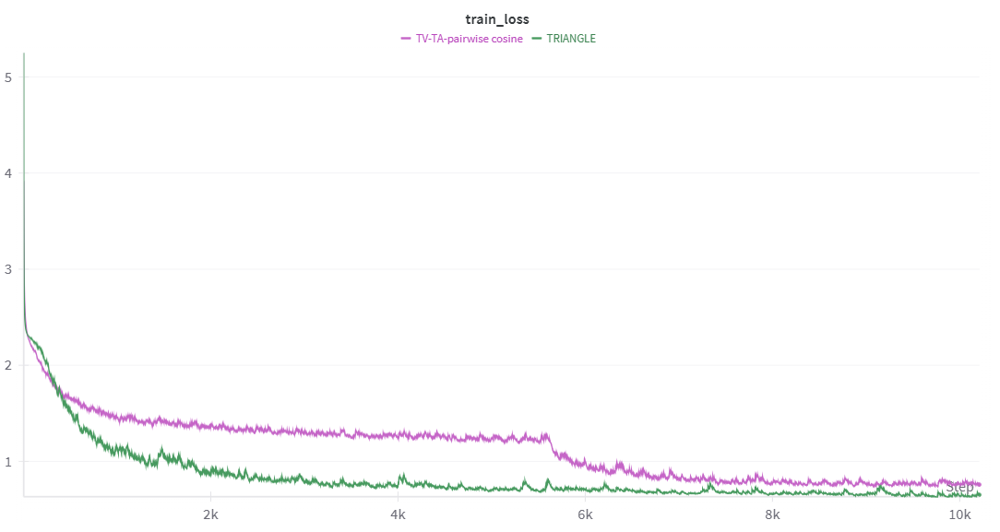
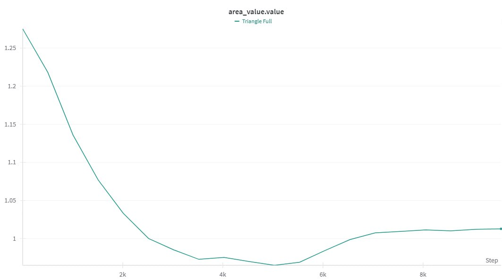
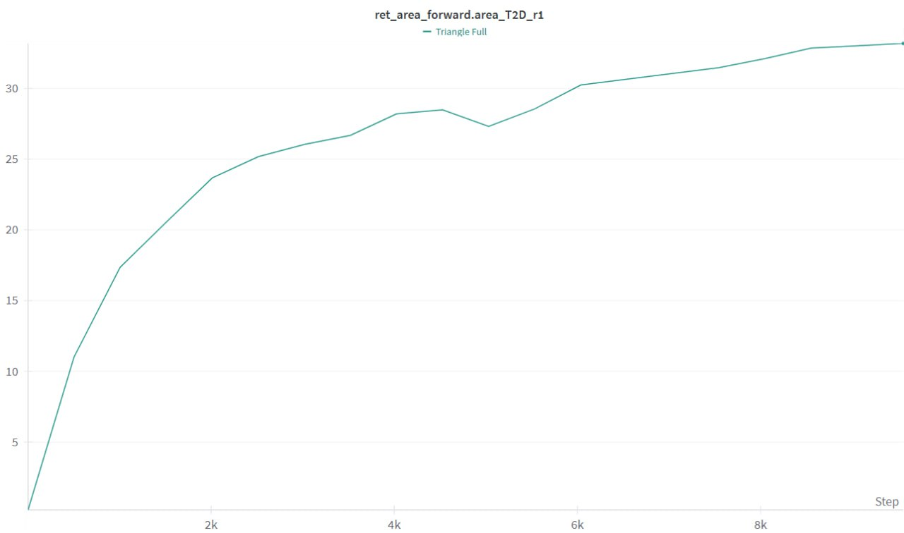

# A TRIANGLE Enables Multimodal Alignment Beyond Cosine Similarity

## Plots for Reviewer AUzo

### Plot 1.

Losses for TRIANGLE and for the conventional pairwise cosine similarity method. TRIANGLE achieves better convergence.

### Plot 2&3.

Area value among true matching triplets (text-audio-video) plot during training from scratch on MSR-VTT dataset. The value decreases during training, meaning the area is minimized.

Corresponding R@1 score to the plotted area value above during training.
